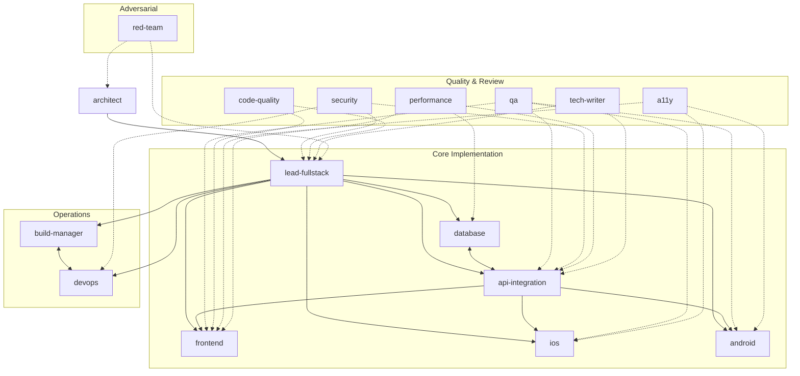

# claude-agents

A team of 16 specialized Claude Code agents for full-stack web and mobile development. Each agent has a defined domain, clear delegation rules, and knows which other agents to hand off to — so you can work at the level you want and let the right specialist handle the rest.

---

## Installation

Clone this repo and copy (or symlink) the agent files into your Claude Code agents directory.

### Option 1 — Copy agents into a project

Place the agents in a `.claude/agents/` directory at your project root. They'll be available only in that project.

```bash
git clone https://github.com/your-org/claude-agents.git
cp claude-agents/.claude/agents/*.md your-project/.claude/agents/
```

### Option 2 — Install globally for all projects

Copy the agents into your global Claude Code config directory so they're available in every project.

```bash
git clone https://github.com/your-org/claude-agents.git
mkdir -p ~/.claude/agents
cp claude-agents/.claude/agents/*.md ~/.claude/agents/
```

### Option 3 — Symlink for live updates

If you want the agents to stay in sync with this repo as it's updated:

```bash
git clone https://github.com/your-org/claude-agents.git
mkdir -p ~/.claude/agents
ln -s "$(pwd)/claude-agents/.claude/agents/"*.md ~/.claude/agents/
```

After installation, restart Claude Code or open a new session. Agents are available immediately via `@agent-name` in any prompt.

---

## Team Structure



**Solid arrows** — primary delegation and handoff paths.
**Dashed arrows** — cross-cutting review and audit relationships.

---

## Agents

### Orchestration

| Agent | Description |
|---|---|
| `lead-fullstack` | Team lead and default orchestrator. Handles cross-cutting features, makes senior technical calls, and delegates to specialists when a task falls squarely in their domain. Start here when you're not sure who owns the work. |

### Design & Architecture

| Agent | Description |
|---|---|
| `architect` | System-level design: service boundaries, data flow, technology selection, scalability planning, and Architecture Decision Records (ADRs). Call before building anything non-trivial. |
| `red-team` | Adversarial review of decisions, plans, and proposals. Challenges assumptions, surfaces second-order effects, and asks whether the team is solving the right problem. Invoke on ADRs, specs, or any decision before it hardens. |

### Core Implementation

| Agent | Description |
|---|---|
| `frontend` | UI components, CSS and styling, client-side state management, browser APIs, and frontend build tooling (Vite, webpack). Works in React, Vue, Svelte, or whatever the project uses. |
| `api-integration` | REST and GraphQL API design, OpenAPI specs, third-party service integrations, webhook handling, and API contract testing. Owns the interface between frontend/mobile and the backend. |
| `database` | Schema design, query optimization, migrations, indexing strategy, and ORM configuration. Covers SQL (PostgreSQL, MySQL) and NoSQL (MongoDB, Redis, DynamoDB). |
| `ios` | Native iOS development in Swift — SwiftUI, UIKit, Xcode, Core Data, Apple frameworks, TestFlight, and App Store submission. |
| `android` | Native Android development in Kotlin — Jetpack Compose, Views, Gradle, Jetpack libraries (Room, WorkManager, Hilt), and Google Play submission. |

### Operations

| Agent | Description |
|---|---|
| `devops` | Docker, Kubernetes, infrastructure-as-code (Terraform/Pulumi), cloud platforms (AWS/GCP/Azure), environment management, and observability setup (metrics, logging, alerting). |
| `build-manager` | CI/CD pipelines, git workflows, branching strategy, release management, semantic versioning, and dependency update automation. Owns the path from commit to deployment. |

### Quality & Review

| Agent | Description |
|---|---|
| `qa` | Test strategy, unit/integration/end-to-end test authoring (Jest, Vitest, Playwright, Cypress, XCTest, Espresso), coverage analysis, and bug reproduction. |
| `security` | OWASP Top 10 reviews, authentication and authorization audits, secrets management, dependency vulnerability scanning, and threat modeling. Call before shipping any feature that touches auth, user data, payments, or file uploads. |
| `code-quality` | Linting and formatter configuration, cyclomatic complexity reduction, naming clarity, dead code elimination, and behavior-preserving refactors. Obsessed with code that reads like clear prose. |
| `a11y` | WCAG 2.1/2.2 AA compliance, ARIA implementation, keyboard navigation, focus management, color contrast, and screen reader compatibility (VoiceOver, TalkBack, NVDA). |
| `performance` | Core Web Vitals, JavaScript bundle analysis, caching strategy, server response time, database query profiling, and load testing. Measures before optimizing, always. |
| `tech-writer` | API documentation, README files, changelogs, OpenAPI specs, inline code documentation, and user guides. Reads the actual code before writing a word about it. |

---

## Usage

Invoke any agent by name in your prompt:

```
@lead-fullstack add a user profile page with avatar upload
@security review the new OAuth implementation
@architect we need to support multi-tenancy — what's the approach?
@database the orders query is timing out — optimize it
@a11y audit the checkout flow for WCAG AA compliance
```

Or describe what you need without naming an agent — `@lead-fullstack` will assess the task and delegate to the right specialist automatically.

### Red team workflow

The `red-team` agent is invoked deliberately, not automatically. Point it at an artifact before the team commits to it:

```
@red-team review this ADR before we finalize it
@red-team challenge our approach to multi-tenancy in architect.md
@red-team we're planning to rewrite the auth layer — is that the right call?
```

The red team produces a structured challenge report with a verdict: **Proceed**, **Proceed with changes**, or **Pause and revisit**. Findings are handed back to the relevant specialist (usually `architect` or `lead-fullstack`) to address before moving forward.
