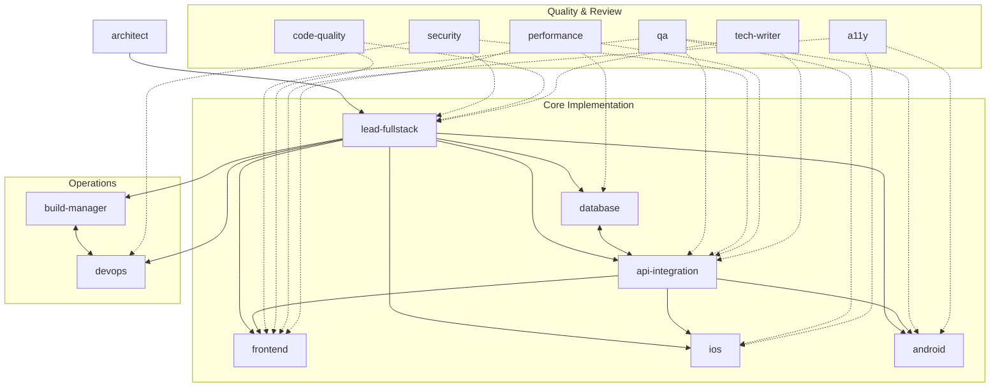

# claude-agents

A team of 15 specialized Claude Code agents for full-stack web and mobile development. Each agent has a defined domain, clear delegation rules, and knows which other agents to hand off to — so you can work at the level you want and let the right specialist handle the rest.

---

## Team Structure



**Solid arrows** — primary delegation and handoff paths.
**Dashed arrows** — cross-cutting review and audit relationships.

---

## Agents

### Orchestration

| Agent | Description |
|---|---|
| `lead-fullstack` | Team lead and default orchestrator. Handles cross-cutting features, makes senior technical calls, and delegates to specialists when a task falls squarely in their domain. Start here when you're not sure who owns the work. |

### Design & Architecture

| Agent | Description |
|---|---|
| `architect` | System-level design: service boundaries, data flow, technology selection, scalability planning, and Architecture Decision Records (ADRs). Call before building anything non-trivial. |

### Core Implementation

| Agent | Description |
|---|---|
| `frontend` | UI components, CSS and styling, client-side state management, browser APIs, and frontend build tooling (Vite, webpack). Works in React, Vue, Svelte, or whatever the project uses. |
| `api-integration` | REST and GraphQL API design, OpenAPI specs, third-party service integrations, webhook handling, and API contract testing. Owns the interface between frontend/mobile and the backend. |
| `database` | Schema design, query optimization, migrations, indexing strategy, and ORM configuration. Covers SQL (PostgreSQL, MySQL) and NoSQL (MongoDB, Redis, DynamoDB). |
| `ios` | Native iOS development in Swift — SwiftUI, UIKit, Xcode, Core Data, Apple frameworks, TestFlight, and App Store submission. |
| `android` | Native Android development in Kotlin — Jetpack Compose, Views, Gradle, Jetpack libraries (Room, WorkManager, Hilt), and Google Play submission. |

### Operations

| Agent | Description |
|---|---|
| `devops` | Docker, Kubernetes, infrastructure-as-code (Terraform/Pulumi), cloud platforms (AWS/GCP/Azure), environment management, and observability setup (metrics, logging, alerting). |
| `build-manager` | CI/CD pipelines, git workflows, branching strategy, release management, semantic versioning, and dependency update automation. Owns the path from commit to deployment. |

### Quality & Review

| Agent | Description |
|---|---|
| `qa` | Test strategy, unit/integration/end-to-end test authoring (Jest, Vitest, Playwright, Cypress, XCTest, Espresso), coverage analysis, and bug reproduction. |
| `security` | OWASP Top 10 reviews, authentication and authorization audits, secrets management, dependency vulnerability scanning, and threat modeling. Call before shipping any feature that touches auth, user data, payments, or file uploads. |
| `code-quality` | Linting and formatter configuration, cyclomatic complexity reduction, naming clarity, dead code elimination, and behavior-preserving refactors. Obsessed with code that reads like clear prose. |
| `a11y` | WCAG 2.1/2.2 AA compliance, ARIA implementation, keyboard navigation, focus management, color contrast, and screen reader compatibility (VoiceOver, TalkBack, NVDA). |
| `performance` | Core Web Vitals, JavaScript bundle analysis, caching strategy, server response time, database query profiling, and load testing. Measures before optimizing, always. |
| `tech-writer` | API documentation, README files, changelogs, OpenAPI specs, inline code documentation, and user guides. Reads the actual code before writing a word about it. |

---

## Usage

Invoke any agent by name in your prompt:

```
@lead-fullstack add a user profile page with avatar upload
@security review the new OAuth implementation
@architect we need to support multi-tenancy — what's the approach?
@database the orders query is timing out — optimize it
@a11y audit the checkout flow for WCAG AA compliance
```

Or describe what you need without naming an agent — `@lead-fullstack` will assess the task and delegate to the right specialist automatically.
